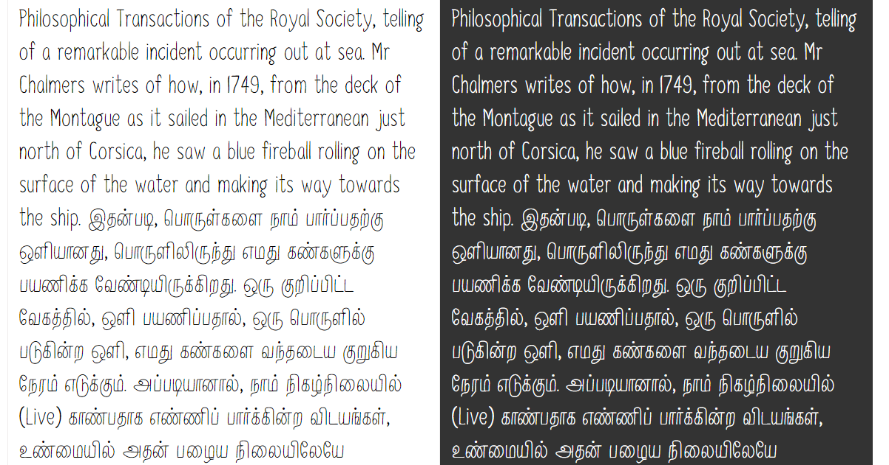

## Work in Progress

Currently refactoring Neythal to add FDK compliant features and add some more refinements.

# Neythal Font

Neythal is a handwriting font that adds the feeling of authentic handwriting to your texts and it comes in two gorgeous styles. It can used to make classically modern designs and typographical stuff. It fits everywhere as it awesomely thin to adopt where it is placed. 

Fun fact about the name of the font: Neythal is a [Tamil](http://en.wikipedia.org/wiki/Tamil_language) word and it's the word for seashore and adjoining lands. I love places with lovely seashore very much.

## Language Support

Albanian, Basque, Breton, Chamorro, Danish, Dutch, English, Faroese, Finnish, French, Frisian, Galician, German, Icelandic, Italian, Malagasy, Norwegian, Portuguese, Spanish, Swedish, Tamil

## Specimen

## Installing 

You can grab the ttf files from the build folder in this repository and install it on your systems.

## Getting Involved

Here is how **you** can help and contribute to the development of Neythal font.

1. Tell me about any bugs you find, or enhancements you would like to see

2. Contribute directly to the font. Complete set of source files are available in this repository as UFO files.

### Bug Reports & Glyph requests

Send me bug reports, feature enhancements or glyph requests, using the [Github Issue Tracker](https://github.com/enathu/neythal-font/issues/).

## License

Copyright (c) 2014, Tharique Azeez ([niram.org](http://niram.org)|[zeezat@gmail.com](zeezat@gmail.com))

Neythal is licensed under the SIL Open Font License v1.1 (<http://scripts.sil.org/OFL>)
